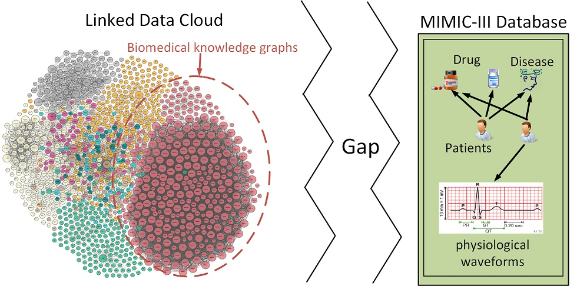
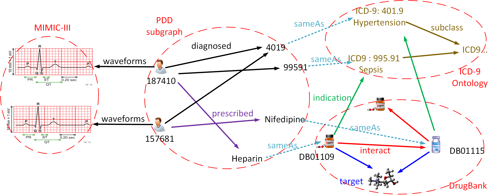

# PDD Graph： Patient-Disease-Drug Graph, Bridging MIMIC-III and Linked Data Cloud

# The latest news

We have released version 1.2

In the new version, we have eliminated an engineering bug that was made when label matching of ICD-9 codes. This bug results in the linking failures of 380 diseases in MIMIC-III.

For diseases in the latest PDD version, the overall number of diseases is 6985, and 6,983 diseases are connected to ICD-9 ontology. The only two failed matching codes are '71970' and 'NULL', which are not included in ICD-9 ontology.

# Note

If you use PDD Graph data in your work, please cite the following publication:

*   _Wang, M., Zheng, J., Liu, J., Hu, W., Wang, S., Li, X., & Liu, W. (2017, October). PDD Graph: Bridging Electronic Medical Records and Biomedical Knowledge Graphs via Entity Linking. In International Semantic Web Conference(ISWC 2017). Springer International Publishing._

We ask that users who download significant portions of the database cite the MIMIC-III paper in any resulting publications.

*   _MIMIC-III, a freely accessible critical care database. Johnson AEW, Pollard TJ, Shen L, Lehman L, Feng M, Ghassemi M, Moody B, Szolovits P, Celi LA, and Mark RG. Scientific Data (2016). DOI: 10.1038/sdata.2016.35._

# Introduction

The **gap** between clinical data and biomedical knowledge graphs:
  * An EMR database, MIMIC-III: contains multi-format electronic data but remains limitations in scope.
  * Biomedical KGs: cover basic medical facts, but contain little information about clinical outcomes.

The gap between clinical data and biomedical KGs prohibits further exploring medical entity relationships on ether side, as shown in the following figure:

What is **PDD Graph** (Patient-Disease-Drug Graph):

Electronic medical records contain multi-format electronic medical data that consist of an abundance of medical knowledge. Facing with patients symptoms, experienced caregivers make right medical decisions based on their professional knowledge that accurately grasps relationships between symptoms, diagnosis, and treatments. We aim to capture these relationships by constructing a large and high-quality heterogeneous graph linking patients, diseases, and drugs (PDD) in EMRs.

Specifically, we extract important medical entities from MIMIC-III (Medical Information Mart for Intensive Care III) and automatically link them with the existing biomedical knowledge graphs, including ICD-9 ontology and DrugBank. The PDD graph presented is accessible on the Web via the SPARQL endpoint, and provides a pathway for medical discovery and applications, such as effective treatment recommendations.

A subgraph of PDD is illustrated in the following figure to better understand the PDD graph.

# Download

You can download it from different places. We offer two different formats in this site .

#### [Format 1：N-Triples](http://kmap.xjtudlc.com/pdd/data/pdd_nt.zip)

RDF data files ended by _.nt_.

#### [Format 2：Apache Jena](http://kmap.xjtudlc.com/pdd/data/pdd_jena_tdb.zip)

Formatted by Apache Jena TDB , you can user it in Jena API.

### Download elsewhere

*   [Datahub](https://datahub.io/dataset/pdd-graph)

# Friendly Link

Our data uses other resources, so we make a statement here.

*   [MIMIC-III](https://mimic.physionet.org/)
*   [Bio2RDF](http://bio2rdf.org/)
*   DrugBank
    *   [version 1](https://datahub.io/dataset/bio2rdf-drugbank)
    *   [version 2](http://wifo5-03.informatik.uni-mannheim.de/drugbank/)
*   [ICD-9 ontology](http://bioportal.bioontology.org/ontologies/ICD9CM)

# License

This work is licensed under a [Creative Commons Attribution 4.0 International License](http://creativecommons.org/licenses/by/4.0/).

# Contact

<li>Meng Wang <a href="mailto:wangmengsd@stu.xjtu.edu.cn">wangmengsd@stu.xjtu.edu.cn</a></li>

# Update

*   ### V1.2

    Fix the bugs in "diagnose_icd_information.nt".

    In the new version, we have eliminated an engineering bug that was made when label matching of ICD-9 codes. This bug results in the linking failures of 380 diseases in MIMIC-III.
  
     For diseases in the latest PDD version, the overall number of diseases is 6985, and 6,983 diseases are connected to ICD-9 ontology. The only two failed matching codes are '71970' and 'NULL', which are not included in ICD-9 ontology.

*   ### V1.1

    Add Patient BMI data.

# More Information 

[Github Pages](https://wangmengsd.github.io/pdd-graph/)

[Website](http://kmap.xjtudlc.com/pdd)

[DataHub URL](https://datahub.io/tl/dataset/pdd-graph)

[Data dump](http://kmap.xjtudlc.com/pdd/data/pdd_nt.zip)

[SPARQL endpoint](http://kmap.xjtudlc.com/pdd/dataset.html?tab=query&ds=/pdd)
